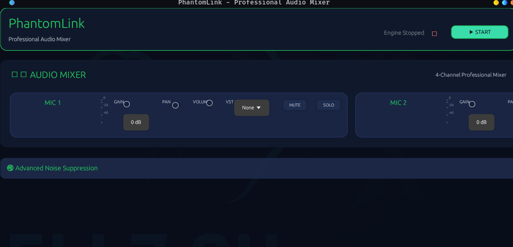

# PhantomLink

<div align="center">
  
  
  <p><strong>Professional Audio Mixer for Linux</strong></p>
  
  
  
  
  
  
</div>

---

PhantomLink is a high-performance, Rust-based professional audio mixer and routing application designed specifically for Linux systems. Inspired by Wavelink XLR and professional mixing software, PhantomLink provides RTX Voice-like noise suppression capabilities with a modern, touch-friendly interface.

## 📸 Screenshots

<div align="center">
  
  <p><em>Modern, professional interface with real-time spectrum analysis</em></p>
</div>

---

## ✨ Features

### 🎛️ Professional Audio Mixing
- **4-Channel Professional Mixer** with modern, touch-friendly controls
- **Real-time Spectrum Analysis** with visual feedback
- **Low-latency audio processing** (<20ms target) optimized for Linux
- **Advanced VU meters** with peak and RMS level monitoring

### 🔇 Advanced Noise Suppression
- **Multi-tier denoising system** (Basic, Enhanced, Maximum modes)
- **RTX Voice-like capabilities** for Linux users
- **Real-time performance monitoring** with adaptive mode switching
- **Future AI model support** (Facebook Denoiser, DNS Challenge models)

### 🎚️ Hardware Integration
- **Focusrite Scarlett Solo Gen 4** full hardware support
- **Direct monitor control** and gain adjustment
- **Multi-device audio routing** capabilities
- **JACK audio server** integration ready

### 🔌 Plugin & Extension Support
- **VST plugin integration** for audio enhancements
- **Automatic plugin scanning** and management
- **Real-time audio effects** processing
- **Modular architecture** for easy extensibility

### 🎨 Modern User Interface
- **Glass-effect modern design** inspired by Wavelink XLR
- **Touch-friendly controls** with larger hit targets
- **Consistent green accent theme** throughout the interface
- **Tabbed interface** (Mixer, Applications, Advanced)
- **Real-time visual feedback** and status indicators

---

## 🚀 Installation

### From Source (Recommended)
```bash
# Clone the repository
git clone https://github.com/ghostkellz/phantomlink.git
cd phantomlink

# Build and install
cargo build --release
cargo install --path .
```

### From Crates.io
```bash
cargo install phantomlink
```

### Arch Linux (AUR)
```bash
# Using yay or paru
yay -S phantomlink-git

# Or manually
git clone https://aur.archlinux.org/phantomlink-git.git
cd phantomlink-git
makepkg -si
```

### Prerequisites
- **Rust 1.70+** (latest stable recommended)
- **ALSA development libraries** (`libasound2-dev` on Debian/Ubuntu)
- **VST SDK** (optional, for plugin support)

## 🎵 Quick Start

1. **Launch PhantomLink**:
   ```bash
   phantomlink
   ```

2. **Connect your audio interface** (Scarlett Solo Gen 4 recommended)

3. **Configure your mixer**:
   - Navigate to the **Mixer** tab
   - Adjust channel levels and routing
   - Enable noise suppression in the **Advanced** tab

4. **Load VST plugins** (optional):
   - Select plugins from the dropdown in each channel strip
   - Configure parameters through the plugin interface

## 🔧 Configuration

PhantomLink automatically detects and configures:
- Audio hardware interfaces
- Available VST plugins
- Optimal buffer sizes and sample rates

Advanced configuration is available through the **Advanced** tab in the GUI.

## 🏗️ Architecture

PhantomLink features a modular architecture designed for performance and extensibility:

- **Audio Engine**: High-performance audio processing core
- **GUI Framework**: Modern egui-based interface
- **Plugin System**: VST plugin integration
- **Hardware Abstraction**: ALSA/JACK audio backend support
- **Denoising System**: Multi-tier noise suppression pipeline

## 🤝 Contributing

We welcome contributions! Please see our [Contributing Guidelines](CONTRIBUTING.md) for details.

### Development Setup
```bash
git clone https://github.com/ghostkellz/phantomlink.git
cd phantomlink
cargo build
cargo test
```

## 📄 License

Licensed under the MIT License. See [LICENSE](LICENSE) for details.

## 👥 Authors

- **Christopher Kelley** <ckelley@ghostkellz.sh> - *Creator & Lead Developer*
- **CK Technology** - *2025*

## 🙏 Acknowledgments

- Inspired by **Wavelink XLR** and professional audio mixing software
- Built with the amazing **Rust** ecosystem
- **egui** for the modern GUI framework
- **RNNoise** for baseline noise suppression capabilities

---

<div align="center">
  <strong>PhantomLink — Professional Audio Mixing for Linux</strong><br>
  <em>Unleash your creative potential with professional-grade audio tools</em>
</div>

