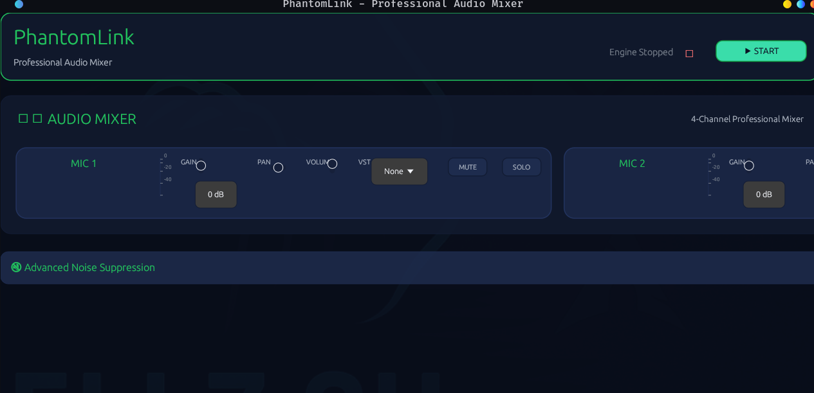

# PhantomLink

<div align="center">
  

  <h3>Professional Audio Mixer & Interface Control for Linux</h3>
  <p><em>Wavelink XLR Experience with RTX AI Noise Suppression</em></p>

  <!-- Build & Platform -->
  
  
  
  

  <!-- Audio Stack -->
  
  
  

  <!-- Hardware & AI -->
  
  
  

  <!-- Features -->
  
  
  

  <br/>

  
  
  
  

</div>

---

> **Note:** PhantomLink is an experimental project and still needs plenty of testing. I saw a gap on Linux when it comes to Wavelink XLR-style audio mixing and NVIDIA Broadcast functionality, so I'm building this to fill that void. Contributions, bug reports, and feedback are welcome!

---

PhantomLink brings the **Elgato Wavelink XLR** experience to Linux with **RTX-accelerated AI noise suppression** powered by [GhostWave](https://github.com/ghostkellz/ghostwave). Built in Rust for maximum performance, it provides professional audio mixing, full hardware control for **Focusrite Scarlett Solo 4th Gen**, and studio-quality noise removal using NVIDIA Tensor Cores.

## Screenshots

<div align="center">
  
  <p><em>Professional mixer interface with real-time spectrum analysis and hardware meters</em></p>
</div>

---

## Features

### AI Noise Suppression (GhostWave)
- **RTX 5090 Blackwell FP4** Tensor Core acceleration (2-3x faster)
- **RTX 40/30/20 series** full support with FP16 acceleration
- **CPU fallback** for non-NVIDIA systems
- **Echo Cancellation (AEC)** - removes speaker audio from mic input
- **Voice Activity Detection** - intelligent noise gating
- **Quality profiles**: Fast, Balanced, Quality, Ultra

### Focusrite Scarlett Solo 4th Gen
- **48V Phantom Power** control for condenser mics
- **Air Mode** - Presence / Presence + Drive (ISA transformer emulation)
- **Input Level** - Line / Instrument switching
- **Direct Monitoring** - zero-latency hardware monitoring
- **DSP Routing** - Mix A-F, PCM capture, output routing
- **12-Channel Hardware Meters** - real-time level monitoring

### Professional Mixer
- **Hardware-style gain knobs** with visual arc indicators
- **Segmented VU meters** with peak hold and clip detection
- **Per-channel VST plugin** support
- **Mute/Solo** with visual feedback
- **Pan control** with L/R indicator

### Themes
- **Tokyo Night** - calm blue/purple aesthetic
- **Catppuccin Mocha** - warm pastel dark theme
- **Dracula** - classic purple/cyan
- **Scarlett** - Focusrite-inspired red accents
- **Wavelink** - Elgato-inspired green accents

---

## Installation

### Arch Linux (AUR)
```bash
yay -S phantomlink
```

### Fedora (COPR)
```bash
sudo dnf copr enable ghostkellz/phantomlink
sudo dnf install phantomlink
```

### Ubuntu / Debian / Pop!_OS
```bash
# Download from releases
sudo apt install ./phantomlink_0.2.0_amd64.deb
```

### AppImage (Universal)
```bash
chmod +x PhantomLink-0.2.0-x86_64.AppImage
./PhantomLink-0.2.0-x86_64.AppImage
```

### From Source
```bash
git clone https://github.com/ghostkellz/phantomlink.git
cd phantomlink
cargo build --release
sudo install -Dm755 target/release/phantomlink /usr/bin/phantomlink
```

### Requirements
- **Rust 1.70+** (for building from source)
- **PipeWire** or **ALSA** audio
- **GTK3** for GUI
- **NVIDIA Driver 545+** (optional, for RTX acceleration)

---

## Quick Start

1. **Connect your Scarlett Solo** (or other audio interface)

2. **Launch PhantomLink**
   ```bash
   phantomlink
   ```

3. **Configure hardware** - PhantomLink auto-detects Scarlett Solo
   - Enable 48V phantom power for condenser mics
   - Set Air mode for presence boost
   - Configure input level (Line/Instrument)

4. **Enable AI denoising** - GhostWave panel
   - Select profile (XLR Studio, Streaming, Balanced, Music)
   - Adjust suppression strength
   - Enable echo cancellation if needed

5. **Mix your audio** - Professional channel strips with VU meters

---

## Hardware Support

| Device | Status | Features |
|--------|--------|----------|
| Focusrite Scarlett Solo 4th Gen | Full | Phantom, Air, DSP, Meters |
| Focusrite Scarlett 2i2 4th Gen | Partial | Basic controls |
| Generic USB Audio | Basic | Volume, routing |

| GPU | AI Acceleration | Precision |
|-----|-----------------|-----------|
| RTX 5090/5080 (Blackwell) | Full | FP4 Tensor |
| RTX 4090/4080/4070 (Ada) | Full | FP16 Tensor |
| RTX 3090/3080/3070 (Ampere) | Full | FP16 Tensor |
| RTX 2080/2070 (Turing) | Full | FP16 |
| GTX / Non-NVIDIA | CPU Fallback | FP32 |

---

## Documentation

- [Getting Started](docs/getting-started.md)
- [Features Overview](docs/features.md)
- [Scarlett Solo Setup](docs/scarlett-setup.md)
- [GhostWave AI](docs/ghostwave.md)
- [Installation Guides](docs/installation/)

---

## Architecture

```
┌─────────────────────────────────────────────────────────────┐
│                      PhantomLink GUI                        │
│  ┌─────────────┐  ┌─────────────┐  ┌─────────────────────┐  │
│  │   Mixer     │  │  Scarlett   │  │  GhostWave Settings │  │
│  │  Channels   │  │  Controls   │  │   (AI Denoise)      │  │
│  └─────────────┘  └─────────────┘  └─────────────────────┘  │
└─────────────────────────────────────────────────────────────┘
                              │
┌─────────────────────────────────────────────────────────────┐
│                      Audio Engine                           │
│  ┌─────────────┐  ┌─────────────┐  ┌─────────────────────┐  │
│  │   Channel   │  │    VST      │  │     GhostWave       │  │
│  │  Processing │  │   Plugins   │  │   RTX AI Denoise    │  │
│  └─────────────┘  └─────────────┘  └─────────────────────┘  │
└─────────────────────────────────────────────────────────────┘
                              │
┌─────────────────────────────────────────────────────────────┐
│                    Hardware Layer                           │
│  ┌─────────────┐  ┌─────────────┐  ┌─────────────────────┐  │
│  │   Scarlett  │  │  PipeWire   │  │    NVIDIA CUDA      │  │
│  │    ALSA     │  │    ALSA     │  │   Tensor Cores      │  │
│  └─────────────┘  └─────────────┘  └─────────────────────┘  │
└─────────────────────────────────────────────────────────────┘
```

---

## Contributing

Contributions welcome! See [CONTRIBUTING.md](CONTRIBUTING.md) for guidelines.

```bash
git clone https://github.com/ghostkellz/phantomlink.git
cd phantomlink
cargo build
cargo test
```

---

## License

MIT License - See [LICENSE](LICENSE) for details.

## Author

**Christopher Kelley** <ckelley@ghostkellz.sh>
**CK Technology** - 2025

---

## Acknowledgments

- Inspired by **Elgato Wavelink XLR**
- AI denoising powered by **[GhostWave](https://github.com/ghostkellz/ghostwave)**
- Built with **Rust** and **egui**
- Themes inspired by **Tokyo Night**, **Catppuccin**, **Dracula**

---

<div align="center">
  <strong>PhantomLink</strong> — Professional Audio for Linux<br/>
  <em>RTX-Accelerated AI Noise Suppression • Focusrite Scarlett Control • Wavelink Experience</em>

  <br/><br/>

  
  
  
</div>
